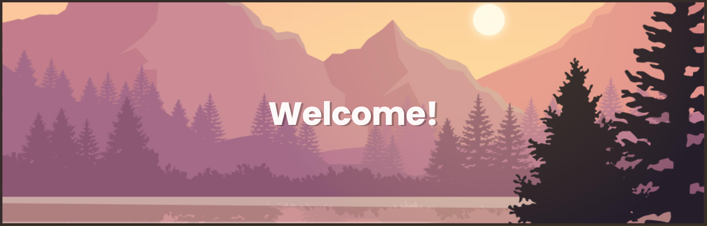

<h3 align="center">Junior Full-Stack Developer</h3>

 <---> 

- 🏗️ I enjoy problem-solving, creating and building web apps
- 🌱 I love to learn new things and always improve my skills
- 🧑🏼‍🍳 Fun fact - **I was a chef for 15 years and owned 3 restaurants!**
- 🍲 Let's cook some creative projects together!

<h3 align="left">Languages and Tools:</h3>

 
<h3 align="left">Connect with me:</h3>

  

            
          
